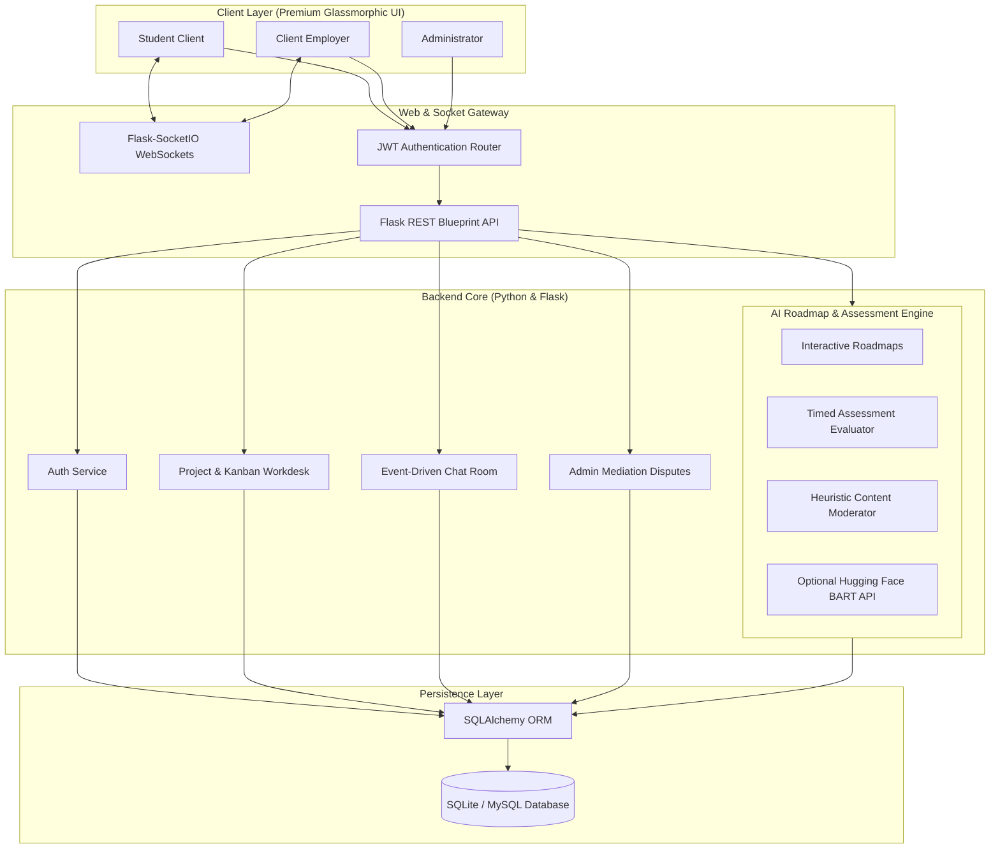

# 🚀 SkillSwap: Complete System Engineering & Project Report

**SkillSwap** is an AI-powered student professional growth ecosystem designed to bridge the gap between academic learning and real-world freelance/collaborative experience. The platform equips students to gain experience, collaborate in real-time, monetize skills, and build verified professional credentials. 

The application is engineered with a premium, high-fidelity **obsidian dark glass aesthetic** (inspired by modern developer interfaces like Linear, Vercel, and Stripe) and is backed by a robust, real-time Python/Flask backend and a secure SQLite/MySQL relational database.

---

## 🗺️ System Architecture Overview

The system employs a client-server architecture powered by **asynchronous event-driven programming (Eventlet)** and **real-time bi-directional WebSockets (Flask-SocketIO)**.



---

## 🎨 UI/UX Design System & Aesthetics

SkillSwap is visually striking, using custom modern design practices to deliver a luxury product feel.

### 1. Cyber Obsidian Color Palette (Frosted Glassmorphism)
The design avoids standard flat colors in favor of high-end dark backgrounds, HSL tailored neon borders, and translucent glass variables:
*   **Base Canvas:** Deep Charcoal/Dark Gray (`#030712` to `#090d16`)
*   **Frosted Glass Overlays:** Semitransparent white backgrounds with high blur (`rgba(255, 255, 255, 0.03)` with `backdrop-filter: blur(12px)`)
*   **Neon Brand Accents:** Cyber Purple (`#8b5cf6`), Electric Violet (`#7c3aed`), and Neon Emerald Green (`#10b981`) for success badges and verification markers.
*   **Subtle Borders:** Frosted thin borders (`1px solid rgba(255, 255, 255, 0.08)`) that catch neon glows dynamically.

### 2. Standardized Typography
*   **Headings:** **Space Grotesk** – A tech-forward, high-contrast, geometric typeface that provides premium visual branding.
*   **Body Copy:** **Plus Jakarta Sans** or **Inter** – Optimized for high-density readability, layout alignment, and clear metadata hierarchy.

### 3. Micro-Animations and Interaction
*   **Glass Card Hover:** Subtle transformations (`transform: translateY(-4px)`) coupled with smooth box-shadow scaling using modern CSS transition values (`transition: all 0.3s cubic-bezier(0.4, 0, 0.2, 1)`).
*   **Action Feedback:** Custom interactive states and micro-animations for triggers like `⚡ Verify Skill` or Kanban board task dragging.

---

## 🧠 Core System Modules & Features

```
┌─────────────────────────────────────────────────────────────────────────┐
│                           SKILLSWAP                              │
├───────────────────┬───────────────────┬───────────────────┬─────────────┤
│ 1. COLLABORATIVE  │ 2. CAREER ENGINE  │ 3. SKILL TESTING  │ 4. RESUME   │
│    WORKDESKS      │    & ROADMAPS     │    & BADGING      │    COMPILER │
└───────────────────┴───────────────────┴───────────────────┴─────────────┘
```

### 1. Notion-Style Collaborative Workdesks
The shared workspace (`student/workspace.html` & `client/workspace.html`) synchronizes status, deliverables, and balances in real time:
*   **Project Lifecycle Timeline:** Visual animated timeline tracking contracts from `Open` ➔ `In Progress` ➔ `Submitted` ➔ `Completed`.
*   **Linear-Style Kanban Board:** A 4-column drag-and-drop board (`To Do`, `In Progress`, `Review`, `Done`) synchronized across clients and students via Socket.IO events.
*   **Escrow Balance Lock & Release:** Funds are locked in an escrow state when a student is hired, and can only be released to their wallet by the client upon milestone approval, or mediated via admin disputes.
*   **Shared Deliverables & Activity Logs:** A central repository for file uploads linked to an immutable, database-backed chronology of project logs.

### 2. Adaptive AI Career Roadmap Engine
Located on `student/career.html`, this module acts as a smart professional compass:
*   **Dynamic Roadmaps:** Supports custom pathways like "Full Stack Engineer", "React Specialist", and "Data Scientist".
*   **Interactive Flowcharts:** Displays connected visual nodes mapping the journey from student to industry professional.
*   **Skill Gaps Scanner:** Compares a student's verified skills against the roadmap requirements and flags missing areas.
*   **One-Click Assessment Launch:** Triggers a quick exam on the spot if a skill gap is detected.
*   **Open Project Matches:** Dynamically filters campus freelance listings that fit the roadmap's milestones.

### 3. Gamified Skill Verification Hub
A testing suite that bridges skills and credentials:
*   **60-Second Timed Quizzes:** Quick technical assessments for Python, React, Design, Machine Learning, and Database Security.
*   **Achievements Unlocked:** Earning $\ge 80\%$ on an exam gives the student `+250 XP`, unlocks a badge (e.g., `🎓 Python Pro`), upgrades their tier (Rookie, Pro, Expert), and pins a permanent **Verified Pro** checkmark on their profile.

### 4. Smart Resume CV Generator
A portfolio compilation tool:
*   Parses student credentials, client reviews, ratings, trust indices, and completed campus projects.
*   Compiles these elements into a cleanly structured **Markdown CV** that can be copied directly to the clipboard or downloaded as an `.md` file.

### 5. Event-Driven Realtime Chat
*   Instant direct messaging between students and clients powered by event-driven Flask-SocketIO.
*   Interactive state indicators (e.g., green online dot, typing indicators, instant notifications).

---

## 🗄️ Relational Database Architecture

SkillSwap uses a relational schema backed by **SQLAlchemy ORM** to coordinate a rich set of user metadata, escrow states, gamification tables, and real-time logs.

### Database Table Relationships
```
   [Role] 1 ──── 💡 ──── 0..* [User] 1 ──── 💡 ──── 1 [FreelancerProfile]
                                │                           │
                                ├────── 0..* [Project] ◄─── ┼── 0..* [UserSkill] ◄─── [Skill]
                                │              ▲            │
                                ├────── 0..* [Application]  └── 0..* [PortfolioItem]
                                │              │
                                ├────── 0..* [Message] ◄──────── [Conversation]
                                │              │
                                ├────── 0..* [Payment (Escrow)]
                                ├────── 0..* [Dispute]
                                ├────── 0..* [AIInterview]
                                └────── 0..* [KanbanTask]
```

### Table & Column Breakdown

| Table Name | Key Purpose | Primary Columns & Data Types |
| :--- | :--- | :--- |
| **`roles`** | Handles platform authorization levels | `id` (INT, PK), `name` (VARCHAR) |
| **`users`** | Core credentials, role mapping, and virtual wallets | `id` (INT, PK), `email` (VARCHAR, Unique), `password_hash`, `wallet_balance` (NUMERIC), `campus` (VARCHAR), `role_id` (FK) |
| **`freelancer_profiles`** | Student CVs, portfolio links, trust ratings, and level XP | `id` (INT, PK), `user_id` (FK), `bio` (TEXT), `headline`, `xp` (INT), `level`, `trust_score` (FLOAT), `availability` |
| **`skills`** & **`user_skills`** | Individual skills and verification states | `id`, `name`, `profile_id` (FK), `skill_id` (FK), `is_verified` (BOOL) |
| **`projects`** | Freelance listings, state tracking, and budgets | `id` (INT, PK), `client_id` (FK), `title`, `budget` (NUMERIC), `status` (Open, In Progress, Submitted, Completed) |
| **`applications`** | Bid cover letters, proposed milestone rates, and statuses | `id` (INT, PK), `project_id` (FK), `applicant_id` (FK), `cover_letter` (TEXT), `status` (Pending, Accepted, Rejected) |
| **`payments`** | Secure escrow pools tracking funded and released balances | `id` (INT, PK), `project_id` (FK), `payer_id` (FK), `payee_id` (FK), `amount` (NUMERIC), `status` (Escrowed, Completed, Disputed) |
| **`kanban_tasks`** | Notion-Style collaborative tasks | `id` (INT, PK), `project_id` (FK), `title`, `column` (todo, in_progress, review, done), `assigned_to_id` (FK) |
| **`ai_interviews`** | Test history, scores, and evaluation reports | `id` (INT, PK), `user_id` (FK), `skill_name`, `score` (INT), `evaluation_report` (TEXT) |
| **`disputes`** | Mediation records for locked escrow accounts | `id` (INT, PK), `project_id` (FK), `reporter_id` (FK), `reason` (TEXT), `status` (Open, Resolved) |

---

## 🤖 AI & Intelligence System Design

The custom **`backend/ai/routes.py`** endpoint suite uses a hybrid heuristics engine (with hooks for Hugging Face BART transformers) to power smart platform features:

1.  **AI Chatbot (`/api/ai/chatbot`):** An interactive assistant. It queries active database metrics to supply dynamic replies:
    *   *"How many open projects are there?"* ➔ Dynamically counts and displays available contract listings.
    *   *"Who are the top freelancers?"* ➔ Queries profiles sorted by rating and lists the top 3 student names, headlines, and reviews.
    *   *"Show my balance"* ➔ Inspects the logged-in JWT context and returns their exact wallet credit amount.
2.  **Scam & Toxic Abuse Content Moderator (`/api/ai/moderate`):** A custom regex-based analyzer that filters spam and scams. It scans text descriptions for suspicious phrases (e.g., *"wire transfer"*, *"western union"*, *"WhatsApp me at"*, *"telegram me"*), and toxic language, flagging them for admin review with confidence indexes.
3.  **Quiz Generator & Evaluator (`/api/ai/interviews/evaluate`):** Pre-compiled timed assessments in Python, React, Design, Machine Learning, and Database Security. Once evaluated, it dynamically adjusts the student's database state:
    *   Sets `FreelancerProfile.is_verified = True`
    *   Adds `+250 XP`
    *   Upgrades student titles (Rookie ➔ Pro ➔ Campus Expert)
    *   Populates the visual **`Achievements`** dashboard table.
4.  **Career Analytics Tracker (`/api/ai/analytics`):**
    *   **For Students:** Generates earnings projection sparklines, analyzes local skill trends, and calculates platform success rates.
    *   **For Clients:** Summarizes hiring behaviors, displays mid-semester budget analytics, and details overall freelance quality indexes.
5.  **Smart Project Idea Generator (`/api/ai/ideas-generator`):** Generates custom project outlines based on a student's skills (e.g., *"Real-Time Campus Traffic Analytics Server"* for Python developers).

---

## 🔒 Security & Reliability Infrastructure

SkillSwap is engineered for secure environments, defending against common vulnerabilities:

*   **JWT Session Authentication:** Access and refresh JSON Web Tokens are cryptographically signed. They are securely delivered to client browsers via HTTP-only cookies and Authorization headers.
*   **Role-Based Access Control (RBAC):** Strict view routing blocks students from executing escrow releases, clients from submitting technical evaluations, and restricts administrative views (disputes, users) to admin credentials.
*   **SQL Injection (SQLi) Prevention:** Parameters are strictly bound using SQLAlchemy's query constructor. Plain, concatenated SQL strings are blocked across all models.
*   **Cross-Site Scripting (XSS) Mitigation:** Inputs are passed through sanitization filters (`sanitize_text()`) before being saved to the database.
*   **API IP Rate Limiting:** Flask-Limiter monitors request rates on sensitive endpoints (e.g., `/api/auth/login`, `/api/ai/chatbot`) to prevent brute-force attacks.
*   **Health & Status Monitoring (`/api/health`):** A dedicated diagnostic route that verifies active relational database and SocketIO server connections in real time.

---

## 🚀 DevOps, Deployment & QA Workflows

### 1. Multi-Platform Deployment Archetypes
The codebase includes structured instructions for several deployment targets:

> [!NOTE]
> Regardless of the platform selected, the core application relies on asynchronous WSGI execution. Run the server using Gunicorn and Eventlet workers to handle real-time WebSockets efficiently:
> ```bash
> gunicorn --worker-class eventlet -w 1 backend.app:app
> ```

*   **Render:** Deploy as a **Web Service** with Gunicorn and an attached MySQL addon. Initialize the database using the seeding script.
*   **Railway:** Set up direct deployment from GitHub with a MySQL plugin, using the visual Environment variables dashboard.
*   **PythonAnywhere:** Configure static mapping directories (`/frontend` & `/uploads`) with WSGI configurations pointing directly to `backend.app:app`.

### 2. Manual QA & Testing Checklist

#### Authentication & Authorization
- [ ] Sign up new students and clients with valid domain filters.
- [ ] Confirm protected routes redirect properly to `/login.html` when unauthorized.
- [ ] Validate JWT token persistence in browser `localStorage`.

#### Student Actions
- [ ] Update biography, work experience, education, and portfolio links.
- [ ] Search and apply to open jobs, verifying custom rate inputs.
- [ ] Launch, complete, and pass a technical quiz to verify badge awards.
- [ ] Run the AI Career Roadmap and verify that skill-gaps and recommendations load correctly.

#### Client Actions
- [ ] Create and post a new freelance contract.
- [ ] Accept a student's bid, locking the budget into virtual Escrow.
- [ ] Interact with the shared collaborative Kanban workspace and timeline stepper.
- [ ] Authorize an escrow release, verifying that the student's wallet balance increases.

#### Administration
- [ ] Inspect Dispute listings and confirm the mediation of locked balances.
- [ ] Ban/Unban flagged users and confirm their sessions are revoked.
- [ ] Manage verification queues, approving manual verification uploads.

---

## 📈 Future Upgrades & Project Roadmap

```
  Phase 1 [Current]               Phase 2 [Q3 2026]                Phase 3 [Q1 2027]
  ┌───────────────────────┐       ┌───────────────────────┐        ┌───────────────────────┐
  │ 🔹 Glassmorphic UI    │       │ 🔹 WebRTC Video Calls │       │ 🔹 Real-world stripe  │
  │ 🔹 Heuristic AI Chat  │ ───>  │ 🔹 Live Group Rooms   │  ───>  │    escrow gateway     │
  │ 🔹 Verification Quiz  │       │ 🔹 GitHub Integration │        │ 🔹 Vector similarity  │
  │ 🔹 Kanban Workspace   │       │      (Auto XP updates)│        │    project matches    │
  └───────────────────────┘       └───────────────────────┘        └───────────────────────┘
```

1.  **Integrate Stripe Escrow Gateways:** Transition from virtual credits to real-world currency pools using Stripe's Escrow and Split Checkout API.
2.  **GitHub Automated XP Tracking:** Connect student profiles directly to their GitHub accounts, automatically rewarding XP and verification badges when they commit code to campus projects.
3.  **Live Video Rooms via WebRTC:** Add face-to-face video calling inside collaborative workdesks for daily team meetings.
4.  **Vector-Based Project Matching:** Transition the heuristic matcher into a semantic search system using Vector Embeddings to pair client descriptions with freelancer profiles.

---

> [!TIP]
> To launch a local development copy of SkillSwap, run the following setup commands:
> ```powershell
> python -m venv .venv
> & .venv\Scripts\activate
> pip install -r requirements.txt
> copy .env.example .env
> python database\init_db.py
> python run.py
> ```
